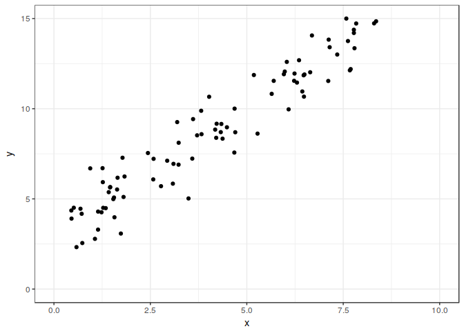

# Fitting with Gradient
Jongbin Jung  
November 14, 2016  

<link rel="stylesheet" href="http://vis.supstat.com/assets/themes/dinky/css/scianimator.css">
<script src="https://ajax.googleapis.com/ajax/libs/jquery/1.7.1/jquery.min.js"></script>
<script src="http://vis.supstat.com/assets/themes/dinky/js/jquery.scianimator.min.js"></script>


# Example with Linear Regression

## Setup

We want to fit a line ($y = ax + b$) to some data, for example


```r
a <- runif(1) + 0.5
b <- runif(1) + 2
example_data <- tibble(x=runif(100, 0, 10), e=rnorm(100)) %>%
  mutate(y=a*x+b+e)
ggplot(example_data, aes(x=x, y=y)) +
  geom_point() +
  scale_y_continuous(limits = c(0, 15)) +
  scale_x_continuous(limits = c(0, 10))
```

```
## Warning: Removed 13 rows containing missing values (geom_point).
```

<!-- -->

Given data $x$ and $y$, for estimated values $\hat{a}, \hat{b}$, define the 
loss function

$$l(a,b) = \frac{1}{N}\sum_i^N(y_i-(\hat{a}x_i+\hat{b}))^2$$


```r
mse <- function(y, x, a, b) {
  mean((y - (a*x + b))^2)
}
```

## Gradient Descent

Partial derivatives for each parameter $a, b$ are calculated: 

$$ \frac{\partial}{\partial a} = \frac{2}{N}\sum_i^N-x_i(y_i-(ax_i+b)) $$
$$ \frac{\partial}{\partial b} = \frac{2}{N}\sum_i^N-(y_i-(ax_i+b)) $$

and a single iteration, given starting points for $a, b$, the data, and learning
rate can be written:


```r
step_gradient <- function(a_now, b_now, data, rate) {
  a_grad <- 2 * mean(-data$x * (data$y - (a_now * data$x + b_now)))
  b_grad <- 2 * mean(-(data$y - (a_now * data$x + b_now)))
  a_new <- a_now - (rate * a_grad)
  b_new <- b_now - (rate * b_grad)
  return(tibble(a=a_new, b=b_new))
}
```

Now, we can take multiple iterations.


```r
coefs <- tibble(a=0, b=0)
rate <- 0.01
MAX_ITER <- 500
for (i in 1:MAX_ITER) {
  now <- coefs %>%
    tail(1)
  
  coefs <- bind_rows(coefs, step_gradient(now$a, now$b, example_data, rate))
}
```

For brevity, let's just take a sample of all iterations


```r
sample_coefs <- coefs %>%
  mutate(iter=1, original_iter=cumsum(iter)) %>%
  slice(c(1:4, seq(5, MAX_ITER, MAX_ITER/50), MAX_ITER)) %>%
  rowwise() %>%
  mutate(loss=mse(example_data$y, example_data$x, a, b)) %>%
  ungroup() %>%
  mutate(iter=cumsum(iter))
```

## Line fit and changes in loss


<div class="scianimator">
<div id="animated_alt" style="display: inline-block;">
</div>
</div>
<script type="text/javascript">
  (function($) {
    $(document).ready(function() {
      var imgs = Array(55);
      for (i = 0; ; i++) {
        if (i == imgs.length) break;
        imgs[i] = "gradient_descent_files/figure-html/animated_alt-" + (i + 1) + ".png";
      }
      $("#animated_alt").scianimator({
          "images": imgs,
          "delay": 1000,
          "controls": ["first", "previous", "play", "next", "last", "loop", "speed"],
      });
      $("#animated_alt").scianimator("play");
    });
  })(jQuery);
</script>

