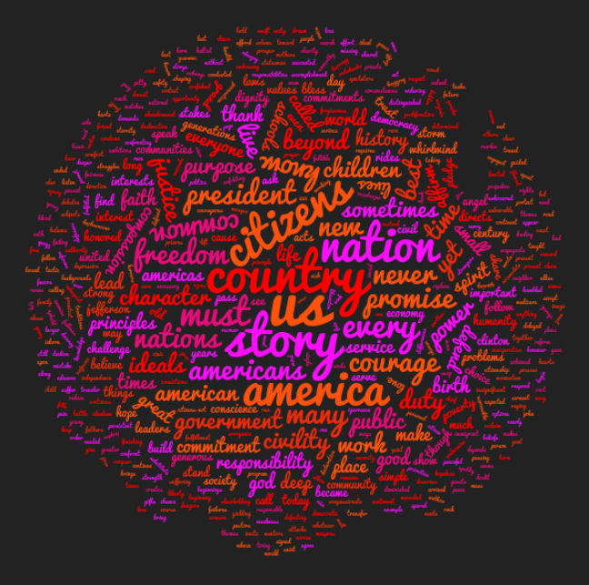
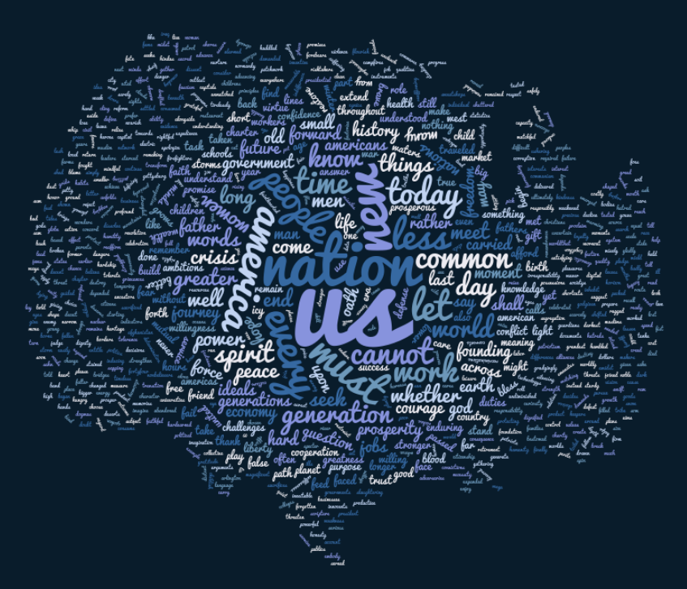

```{r preamble, results='hide', message=FALSE, warning=FALSE}
library(ggplot2)
library(dplyr)

theme_set(theme_bw())

word_counts <- read.csv('../data/inaugural_words.csv')
```

# Word clouds?

Word clouds comparing inauguration speech for Bush (2001) and Obama (2009)

## Bush (2001)



## Obama (2009)



# Unambiguous representation of top 10 words

```{r word counts: bush}
wc <- word_counts %>%
  group_by(name) %>%
  top_n(10, count) 

wc_bush <- wc %>%
  filter(name == 'bush') %>%
  arrange(count)

p <- ggplot(data=wc_bush, aes(x=word, y=count, group=name)) +
  ggtitle('Bush (2001)\n') +
  geom_bar(stat='identity') +
  scale_x_discrete('Word\n', limits=wc_bush$word) +
  scale_y_continuous('\nCount') +
  coord_flip()

p
```

```{r, echo=FALSE}
file_name = 'wordcount_01_bush'
w = 5
h = 5
ggsave(paste0('plots/', file_name, '.pdf'), width=w, height=h)
ggsave(paste0('plots/', file_name, '.png'), width=w, height=h)
```

```{r word counts}
wc_obama <- wc %>%
  filter(name == 'obama') %>%
  arrange(count)

p <- ggplot(data=wc_obama, aes(x=word, y=count, group=name)) +
  ggtitle('Obama (2009)\n') +
  geom_bar(stat='identity') +
  scale_x_discrete('Word\n', limits=wc_obama$word) +
  scale_y_continuous('\nCount') +
  coord_flip()

p
```

```{r, echo=FALSE}
file_name = 'wordcount_02_obama'
w = 5
h = 5
ggsave(paste0('plots/', file_name, '.pdf'), width=w, height=h)
ggsave(paste0('plots/', file_name, '.png'), width=w, height=h)
```