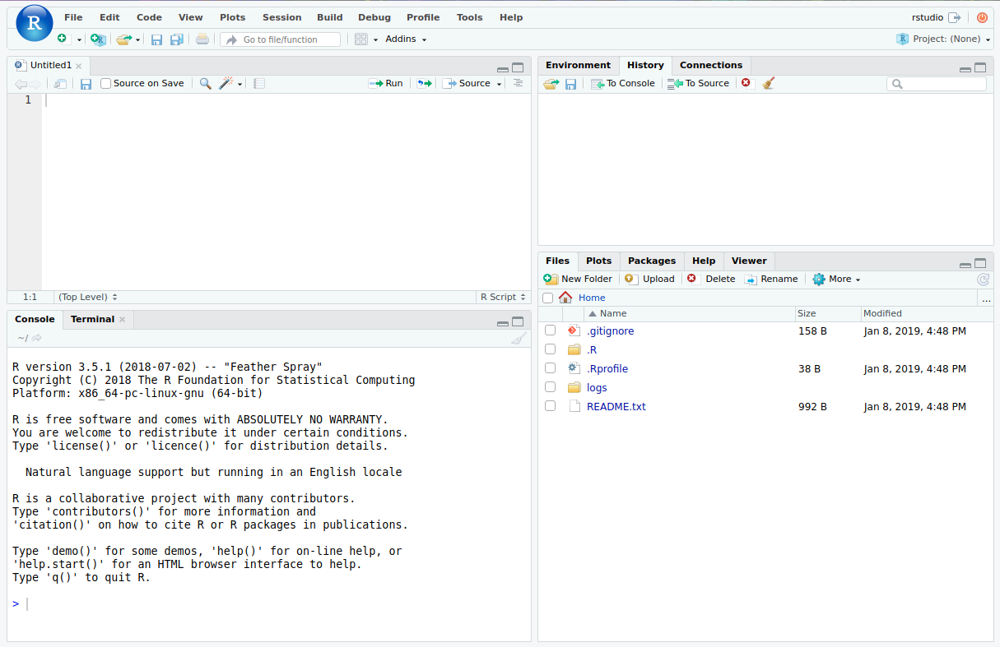

## Dependencies

- Please download and install
    - Latest version `R`
      (*free* -- GPL -- from <https://www.r-project.org/>)
    - Latest version of `Rstudio`
      (also *free* -- [AGPL](http://www.gnu.org/licenses/agpl-3.0.txt) -- from <https://www.rstudio.com/>)

- Alternatively, use cloud services such as
  [MatrixDS](http://matrixds.com) (http://matrixds.com)

## A Question
> You are given three sticks, each of a random length between 0 and 1.

> What's the probability you can make a triangle?

- The answer is 1/2
- By the end of this session, we'll confirm this with a simulation in `R`


## `Rstudio` Basics


## `Rstudio` Basics
- Save/load scripts as text files named `*.R`
- Save/load environment as `.Rdata` file
- `Ctrl` + `L`: Clear console
- `Ctrl` + `#`: Focus on panel `#`
- `Ctrl` + `Enter`: Execute line/selection
- `Ctrl` + `Shift` + `A`: Auto-format selected code
- `Ctrl` + `Shift` + `C`: Comment/Uncomment selection
- `Ctrl` + `Shift` + `/`: Reflow comments
- Many more (if you're willing to explore)

# `R` Basics

## `R` Basics: Working Directory
 - Working directory (`wd`) is where your `R` session will load/save files
 - To see where your current working directory is, run
```{r, eval=FALSE}
getwd()
```
 - To set the working directory to desired `path`, run
```{r, eval=FALSE}
setwd("path")
```

## `R` Basics: Working Directory (cont'd)
 - Note that `~` is replaced with your `HOME` directory, e.g.
 `C:\Users\Username\Documents` in windows
 - Use forward slashes (`/`), even on Windows!
```{r, eval=FALSE, tidy=TRUE}
setwd("~/R")
```
 - **Never** set the working directory to an absolute path in your `R` script
     - Even better, organize your scripts such that you never have to change the
     working directory
     - `setwd()` is best reserved for that time when you started `R` from the
     wrong directory

## `R` Basics: Math Operations
- Simple math operations
```{r, eval=FALSE}
3+11  # add stuff
3-11  # subtract stuff
3/11  # divide stuff
3*11  # multiply stuff
2^10  # raise to powers
```

## `R` Basics: Assignments
 - Convention for assigning values to variables is an arrow(`<-`)[^1]
 - Direction of arrow indicates direction of assignment
```{r, eval=FALSE}
A <- 12
A  # 12
A + 3 -> B
B  # 15
24 -> A
A  # 24
```
 - The equal sign (`=`) also works, but only for assignment to the left, e.g.
```{r, eval=FALSE}
A = 12  # good
12 = A  # BAD
```

[^1]: There are also double arrows (`<<-`) that do something slightly different. We won't talk about it, but if you're interested, see [here](https://stackoverflow.com/questions/2628621/how-do-you-use-scoping-assignment-in-r)

## `R` Basics: Strings
- A `String` variable can be declared in either double quotes(`""`) or
single quotes (`''`)
```{r}
s <- "This is a valid string"
s
s <- 'and so is this'
s
```

## `R` Basics: Re-Assignments
 - A variable can be re-assigned to anything
```{r}
x <- 860306  # first x is assigned a number
x
x <- 'This is a variable!'
x  # Now it is a string

```

# Vectors

## Vectors: `c()`
 - Vectors are the building blocks of `R` --- even a single variable is actually
 an "atomic" vector (vector of size 1)
 - Vectors in `R` are created by *c*oncatenating a series of elements
```{r}
X <- c(1,2,3)
X  # vector of numbers (1, 2, 3)
Y <- c('this', 'that', 'those')
Y  # this is a vector of Strings
```

## Vectors: `seq()`
- Create a vector from a sequence with `seq(from, to, by=1)`
```{r}
seq(1, 10)
seq(1, 10, 2)
```
- Use short-hand `from:to` if you're incrementing by one
```{r}
1:10
```

## Vectors: `rep()`
- Use `rep()` to repeat values
```{r}
rep(13, 4)
rep('Yes!', 3)
rep(c('Sat.', 'Sun.'), 2)
```

## Vectors: `r`*`dist`*`()`
- Sometimes we want to generate samples from known distributions
    - e.g., simulating 1,000 coin flips and counting the number of heads
- For this, we can use the family of `r`*`dist`*`()` functions, where *`dist`*
  is replaced with the desired distribution
  (e.g., `unif`orm, `norm`al, `pois`son)

## Vectors: `r`*`dist`*`()` examples
- Generate vector of $n$ samples from a specified distribution
```{r, eval=FALSE}
runif(n = 10)  # 10 samples from Unif(0, 1)
rnorm(n = 10)  # 10 samples from Norm(0, 1)
rpois(n = 10)  # 10 samples from Poisson(1)
rexp(n = 10)  # 10 samples from Exp(1)
```
- Distribution parameters can be specified as arguments, e.g.
```{r, eval=FALSE}
# 100 samples from a Norm(20, 5) distribution
rnorm(n = 100, mean = 20, sd = 5)
```
- Read documentation for available distributions
```{r}
?Distributions
```

## Vectors: Indexing
- Use square braces (`[]`) to index a vector (base 1)
    - Indexing out-of-bounds returns a special value called `NA`, *does NOT*
      fail
```{r}
X <- c(10, 11, 12, 13)
X[1]
X[4]
X[5]  # Does NOT fail; but returns NA
```

## Vectors: Indexing (cont'd)
- Negative indexing is used to exclude elements
```{r}
X[-1]
```
- Index multiple objects by indexing with a vector
```{r}
ind <- c(2, 4)
X[ind]
```

## Vectors: Re-assignment with Indices
- Replace elements by re-assigning with index
```{r}
X[1] <- 101
X
```
- Replace multiple elements as well
```{r}
X[2:3] <- c(22, 33)
X
```

## Vectors: Add Elements by Index
- Add new elements to a vector by assigning
```{r}
X[5]
X[5] <- 555
X
```


# Vector Operations

## Vector Operations
```{r}
X = c(1:4)
X + X  # element-wise summation
X - X  # element-wise subtraction
```

## Vector Operations (cont'd)
```{r}
X^3   # element-wise exponentiation
X * X  # element-wise multiplication
X %*% X  # dot (inner) product
```

## Vector comparisons
- Comparisons are all done element-wise
```{r}
c(1, 2, 3) == c(1, 2, 4)
c(1, 2, 3) < c(1, 2, 4)
c(1, 2, 3) >= c(1, 2, 4)
```
- Note the double equal sign for comparing equality (one would be assignment!)

## Helpful Vector Functions
- If possible, avoid `loops` by operating over the Vector/Matrix as a whole
```{r, eval=FALSE}
mean(X)                # mean
sd(X)                  # standard deviation
var(X)                 # variance
max(X)                 # maximum
min(X)                 # minimum
median(X)              # median
sum(X)                 # sum
prod(X)                # product
quantile(X,probs=0.5)  # quantile for specified probs
length(X)              # length of the vector
range(X)               # range
```


# Built-in functions

## Some more built-in functions
- We've already seen many built-in functions, but here are some more!
```{r, eval=FALSE}
log(X)   # element-wise log
exp(X)   # element-wise exponential
sqrt(X)  # element-wise square root
```


## Functions for Strings
```{r}
# concatenate two (or more) strings
paste('one plus one equals', 1+1, '!')
# specify a separator
paste('one plus one', 1+1, sep='=')
# if you're into C-style formatting ...
sprintf('one plus one = %d', 1+1)
```

## Functions for Strings (cont'd)
- Often, we want to concatenate strings with no spaces
(e.g., when constructing filenames/paths at run-time)
```{r}
# short-hand for concatenation w/o spaces
filename = 'some_file_name.csv'
paste0('path/to/', filename)
# function specifically for constructing file paths
file.path('path', 'to', filename)
```

## Functions for Strings (cont'd)
- To enforce upper/lower cases
```{r}
s <- 'SoMe CraZY STRING'
tolower(s)
toupper(s)
```

## Generic Functions
- Some functions for exploring objects
```{r}
obj <- 1:100
head(obj, n=5)  # display first n rows of obj
tail(obj, n=5)  # display last n rows of obj
```

## Generic Functions (cont'd)
```{r}
str(obj)  # display structure of obj
summary(obj)  # display summary of obj
```

# Custom functions and control

## Control Flow
- `if` statements
```{r, eval=FALSE}
if (condition) {
  # stuff to do when condition is TRUE
} else if(other_condition) {  # (OPTIONAL)
  # stuff to do if other_condition is TRUE
} else {  # (OPTIONAL)
  # stuff to do if all other conditions are FALSE
}
```

- Some consider the catch-all `else` clause to be dangerous
    - Some style guides even recommend avoiding the use of `else` for better
    readability
- Best practice is to make conditions explicit whenever possible

## Loops: Note!
- Loops in `R` are inefficient[^loops]
- For many cases, there will be a much faster, *vectorized* alternative
  to looping
- We cover loops because there are some *rare* cases in which a loop might
  make more sense, but in general, loops should be avoided when writing `R`

[^loops]: Not entirely true, but loops are still best avoided for other reasons too.

## Loops
- `for` statements
```{r, eval=FALSE}
for (ind in sequence/set) {
  # iterate over sequence or elements of a set
  # do stuff
}
```
- `while` statements
```{r, eval=FALSE}
while (condition) {
  # stuff to do while the condition is TRUE
  # the condition must become FALSE at some point!
}
```

## Loops: Example
```{r}
for (i in 1:3) {
  print(paste('iteration', i))
}

while (i >= 0) {
  print(paste('de-iteration', i))
  i <- i - 1  # beware of infinite loops!
}
```

## User Defined Functions
- Write your own functions in the form
```{r, eval=FALSE}
name_of_function <- function(arguments) {
  # do some stuff with arguments
  return(result)
}
```
- You can use your functions like any other function, e.g.,
```{r, eval=FALSE}
name_of_function(arguments)  # gives you the 'result'
```

## User Defined Functions: Example
- Write a function that will take a vector in $\mathbb{R}^3$ and tell you if you
can make a triangle or not (i.e., return `TRUE` if a triangle can be made and 
`FALSE` otherwise.)
- A solution is on the next slide; try writing your own without looking ahead!

## User Defined Functions: Example solution
```{r}
is_good <- function(vec) {
  for (i in 1:3) {
    # Check if element i is greater than 
    # sum of other two elements
    if (vec[i] > sum(vec[-i])) {
      return(FALSE)
    }
  }
  return(TRUE)
}
```

## User Defined Functions: Improved solution
```{r}
is_good <- function(vec) {
  if (length(vec) != 3) {
      # Always a good idea to make sure your
      # function gets what it expects to get
      stop('is_good requires a vector of length 3')
  }
  for (i in 1:3) {
    if (vec[i] > sum(vec[-i])) {
      return(FALSE)
    }
  }
  return(TRUE)
}
```


## `replicate`
- Loops in `R` are inefficient, and best avoided if possible
- Vectorize operations whenever possible.
- `replicate` can be used to repeat some operation (function),
  and collect the results[^apply]
- e.g., to run `some_function()` 1,000 times and collect the results:
```{r, eval = FALSE}
replicate(1000, some_function())  
```

[^apply]: `replicate` is actually a convenient wrapper for one of the `apply` 
functions, which are more general. See the documentation for details.


# Exercise

## The Question
> You are given three sticks, each of a random length between 0 and 1.

> What's the probability you can make a triangle?

- The answer is 1/2
- Use `R` to simulate 100,000 times and estimate the answer by
    1. generate 100,000 triplets of uniform (0, 1) random variables
    2. find the portion that can be made into a triangle (hint: use the
    `is_good` function)

## Answer 1: Using a for loop
```{r, cache=TRUE}
system.time({  # measure execution time
  N <- 1e5;
  m <- 0
  for (i in 1:N) {
    X <- runif(3)
    if (is_good(X)) {
        m <- m + 1
    }
  }
  cat(sprintf('%.2f%%\n', m / N * 100))
})
```

## Answer 2: No loop 
```{r, cache=TRUE}
system.time({  # measure execution time
  N <- 1e5;
  m <- replicate(N, is_good(runif(3)))
  cat(sprintf('%.2f%%\n',  mean(m) * 100 ))
})
```

# Packages

## Installing `R` Packages
- `R` has many (*MANY*) packages created by other users that implement
state-of-the-art tools (e.g., data manipulation, statistical models)
- These packages can be downloaded from the Comprehensive R Archive Network (CRAN)
- This is as simple as running a single line of code:
```{r, eval=FALSE}
install.packages("package name")
```
- You will have to select one of many CRAN mirrors (copies across different
servers) from which to download the package from
- For example, to install the `tidyverse` package, run
```{r, eval=FALSE}
install.packages("tidyverse")
```
- You only need to do this *once* for each machine


## Loading Packages
- Once you've installed a package on a machine, you can load the package into
your current workspace with the `library()` command
- For example, to use the `tidyverse` package, first load it with
```{r, eval=FALSE}
library("tidyverse")
```

- You can also use specific functions from a package without loading it,
  by telling `R` which package the function belongs to with a namespace prefix,
  `package_name::`.
- For example, to use the `round_any()` function from the `plyr` package,
  without actually loading `plyr`, write
```{r, eval=FALSE}
# Assuming plyr is installed
plyr::round_any()
```

## Namespace collision
- One of the (unfortunately many) things that `R` is bad at is preventing
  namespace collisions
- For example, the packages `plyr` and `dplyr`[^dplyr] have functions that are
  named the same (e.g, `mutate()`, `summarize()`), and if you ever load both,
  `R` will only "see" the function belonging to the package you loaded later
- So beware of what packages you load, and if you only intend to use a function
  or two, consider just specifying the namespace with `::`, instead of loading
  the whole package.

[^dplyr]: `dplyr` is part the tidyverse, and loaded when you load `tidyverse`
