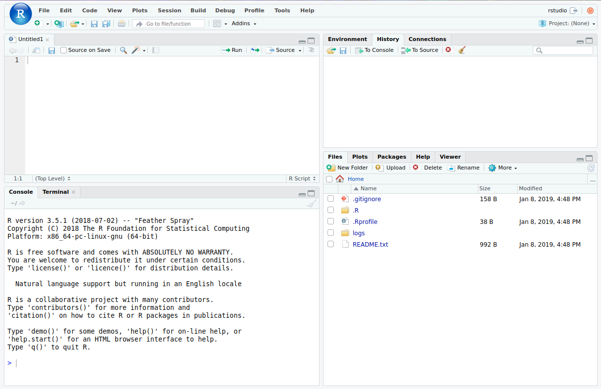

## Dependencies

- Please download and install 
    - Latest version ($\ge$ `3.1.2`) of `R`  
      (*free* -- GPL -- from <https://www.r-project.org/>)
    - Latest version of `Rstudio` 
      (also *free* -- [AGPL](http://www.gnu.org/licenses/agpl-3.0.txt) -- from <https://www.rstudio.com/>)
  
## A Question
> You are given three sticks, each of a random length between 0 and 1.

> What's the probability you can make a triangle?

- The answer is 1/2
- By the end of this session, we'll confirm this with a simulation in `R`


## `Rstudio` Basics


## `Rstudio` Basics
- Save/load scripts as text files named `*.R`
- Save/load environment as `.Rdata` file
- `Ctrl` + `L`: Clear console
- `Ctrl` + `#`: Focus on panel `#`
- `Ctrl` + `Enter`: Execute selection
- `Ctrl` + `Shift` + `C`: Comment/Uncomment selection
- Many more (if you're willing to explore)

# `R` Basics

## `R` Basics: Working Directory
 - Working directory (`wd`) is where your `R` session will load/save files 
 - To see where your current working directory is, run
```{r, eval=FALSE}
getwd()
```
 - To set the working directory to desired `path`, run
```{r, eval=FALSE}
setwd("path")
```
 - Note that `~` is replaced with your `HOME` directory, e.g. 
 `C:\Users\Username\Documents` in windows
 - Use forward slashes (`/`), even on Windows!
```{r, eval=FALSE, tidy=TRUE}
setwd("~/Documents/R")  
```

## `R` Basics: Math Operations
- Simple math operations
```{r, eval=FALSE}
3+11  # add stuff
3-11  # subtract stuff
3/11  # divide stuff
3*11  # multiply stuff
2^10  # raise to powers
```

## `R` Basics: Assignments
 - Convention for assigning values to variables is `<-`
 - Direction of arrow indicates direction of assignment
```{r, eval=FALSE}
A <- 12
A  # 12
A + 3 -> B
B  # 15
24 -> A
A  # 24
```
 - The equal sign (`=`) also works, but only for assignment to the left, e.g.
```{r, eval=FALSE}
A = 12  # good
12 = A  # BAD
```

## `R` Basics: Strings
- A `String` variable can be declared in either double quotes(`""`) or 
single quotes (`''`)
```{r}
str <- "This is a valid string"
str
str <- 'and so is this'
str
```

## `R` Basics: Re-Assignments
 - A variable can be re-assigned to anything
```{r}
x <- 860306  # first x is assigned a number
x
x <- 'This is a variable!' 
x  # Now it is a string

```

# Vectors

## Vectors: `c()`
 - Vectors in `R` are created by *c*oncatenating a series of elements
```{r}
X <- c(1,2,3)
X  # vector of numbers (1, 2, 3)
Y <- c('this', 'that', 'those')
Y  # this is a vector of Strings
```

## Vectors: `seq()` 
- Create a vector from a sequence with `seq(from, to, by=1)`
```{r}
seq(1, 10)
seq(1, 10, 2)
```
- Use short-hand `from:to` if you're incrementing by one
```{r}
1:10
```

## Vectors: `rep()`
 - Use `rep()` to repeat values
```{r}
rep(13, 4)
rep('Yes!', 3)
rep(c('Sat.', 'Sun.'), 2)
```

## Vectors: `r`*`dist`*`()`
- Generate vector of $n$ samples from a specified distribution
```{r, eval=FALSE}
runif(n = 10)  # 10 samples from Unif(0, 1)
rnorm(n = 10)  # 10 samples from Norm(0, 1)
rpois(n = 10)  # 10 samples from Poisson(1)
rexp(n = 10)  # 10 samples from Exp(1)
```
- Distribution parameters can be specified as arguments, e.g.
```{r, eval=FALSE}
# 100 samples from a Norm(20, 5) distribution
rnorm(n = 100, mean = 20, sd = 5)
```
- Read documentation for available distributions
```{r}
?Distributions
```

## Vectors: Indexing
- Use square braces (`[]`) to index a vector (base 1)
```{r}
X <- c(10, 11, 12, 13)
X[1]
X[4]
X[5]
```

## Vectors: Indexing (cont'd)
- Negative indexing is used to exclude elements
```{r}
X[-1]
```
- Index multiple objects by indexing with a vector
```{r}
ind <- c(2, 4)
X[ind]
```

## Vectors: Re-assignment with Indices
- Replace elements by re-assigning with index
```{r}
X[1] <- 101
X
```
- Replace multiple elements as well
```{r}
X[2:3] <- c(22, 33)
X
```

## Vectors: Add Elements by Index
- Add new elements to a vector by assigning
```{r}
X[5]
X[5] <- 555
X
```

## Vectors: Advanced Indexing
- Vectors can be indexed by a binary vector (`TRUE/FALSE`) of equal length
- i.e., you can index vectors by a specified condition, e.g.,
```{r}
X <- 1:100
# create a binary vector with the same length of X
# where the element is TRUE if the element of X
# in the corresponding position satisfies condition
ind <- X > 95  
tail(ind)  # take a peek at the last few entries
X[ind]
```

# Matrices

## Creating Matrices
- A matrix is created from a vector, using `matrix()`, e.g.
```{r}
X <- c(1:12)
# syntax: matrix(vector, # of rows, # of columns)
A <- matrix(X, 3, 4)
A
```

- Notice that the matrix is created column-first

## Matrix Indexing
- Similar to vectors, a matrix can be indexed with square braces,
with the syntax `[row #, col #]`, e.g.
- Leaving an entry empty will result in the full row/column
```{r}
A[3,2]  # third row, second column
A[2,]   # entire second row
A[,4]   # entire fourth column
```

# Vector/Matrix Operations

## Vector Operations
```{r}
X = c(1:4)
t(X)  # transpose (column) vector X to row vector
X + X  # element-wise summation
X - X  # element-wise subtraction
```

## Vector Operations (cont'd)
```{r}
X^3   # element-wise exponentiation
X * X  # element-wise multiplication
X %*% X  # dot (inner) product
```

## Matrix Operations
```{r}
A = matrix(1:4, 2, 2)  # create 2x2 matrix
t(A)  # transpose (column) vector A to row vector
A + A  # element-wise summation
A - A  # element-wise subtraction
```

## Matrix Operations (cont'd)
```{r}
A^3   # element-wise exponentiation
A * A  # element-wise multiplication
A %*% A  # dot (inner) product
```

## Matrix Operations: Warning
- Dimensions must make sense!
```{r, error=TRUE}
A <- matrix(1:6, 2, 3)
B <- matrix(1:6, 3, 2)
A %*% B  # 2x3 times 3x2: OK
A %*% A  # 2x3 times 2x3: Nope
```

## Vector/Matrix Comparisons
- Comparisons are all done element-wise
```{r}
c(1, 2, 3) == c(1, 2, 4)
c(1, 2, 3) < c(1, 2, 4)
c(1, 2, 3) >= c(1, 2, 4)
```
- Note the double equal sign for comparing equality (one would be assignment!)

## Helpful Vector Functions
- If possible, avoid `loops` by operating over the Vector/Matrix as a whole
```{r, eval=FALSE}
mean(X)					# mean
sd(X)					# standard deviation
var(X)					# variance
max(X)      			# maximum
min(X)      			# minimum
median(X)				# median
sum(X)      			# sum
prod(X)					# product
quantile(X,probs=0.5)	# quantile for specified probs
length(X)   			# length of the vector
range(X)				# range
```

## Helpful Matrix Functions
- If possible, avoid `loops` by operating over the Vector/Matrix as a whole
```{r, eval=FALSE}
rowSums(A)	# Row sums
colSums(A)	# Column sums
rowMeans(A)	# Row means
colMeans(A)	# Columns means
diag(A)		# Diagonal of a matrix
solve(A)	# Inverse of a matrix
cov(A)		# Variance covariance matrix
cor(A)		# Correlation matrix
```

# Functions

## Some more built-in functions
- We've already seen many built-in functions, but here are some more!
```{r, eval=FALSE}
log(X)  # element-wise log 
exp(X)  # element-wise exponential 
sqrt(X)  # element-wise square root
```

## Functions for Strings
```{r}
# concatenate two (or more) strings
paste('one plus one equals', 1+1, '!')  
# specify a separator
paste('one plus one', 1+1, sep='=')  
# if you're into C-style formatting ...
sprintf('one plus one = %d', 1+1)
```

## Functions for Strings (cont'd)
- Often, we want to concatenate strings with no spaces 
(e.g., when constructing filenames/paths in run-time)
```{r}
# short-hand for concatenation w/o spaces
filename = 'some_file_name'
paste0('path/to/', filename, '.csv')  
paste0(getwd(), '/', filename, '.csv')  
```

## Functions for Strings (cont'd)
- To enforce upper/lower cases
```{r}
s <- 'SoMe CraZY STRING'
tolower(s)
toupper(s)
```

## Generic Functions
- Some functions for exploring objects
```{r}
obj <- 1:100
head(obj, n=5)  # display first n rows of obj
tail(obj, n=5)  # display last n rows of obj
```

## Generic Functions (cont'd)
```{r}
str(obj)  # display structure of obj
summary(obj)  # display summary of obj
```

## Control Flow
- `if` statements
```{r, eval=FALSE}
if (condition) {
    # stuff to do when condition is TRUE
} else if(other_condition) {  # (OPTIONAL)
    # stuff to do if other_condition is TRUE
} else {  # (OPTIONAL)
    # stuff to do if all conditions are TRUE
}
```

## Loops
- `for` statements
```{r, eval=FALSE}
for (ind in sequence/set) {  
    # iterate over sequence or elements of a set
    # do stuff
}
```
- `while` statements
```{r, eval=FALSE}
while (condition) {
    # stuff to do while the condition is TRUE
    # the condition must become FALSE at some point!
}
```

## Loops: Example
```{r}
for (i in 1:3) {
    print(paste('iteration', i))
}

while (i >= 0) {
    print(paste('de-iteration', i))
    i <- i - 1  # beware of infinite loops!
}
```

## User Defined Functions
- Write your own functions in the form
```{r, eval=FALSE}
name_of_function <- function(arguments) {
    # do some stuff with arguments
    return(result)
}
```
- You can use your functions like any other function, e.g.,
```{r, eval=FALSE}
name_of_function(arguments)  # gives you the 'result'
```

## User Defined Functions: Example
- Write a function that will take a vector in $\mathbb{R}^3$ and tell you if you can make a triangle or not
```{r}
is_good <- function(vec) {
    if (length(vec) != 3) {
        # it's always a good idea to make sure your 
        # function gets what it expects to get
        stop('is_good requires a vector of length 3')
    }
    for (i in 1:3) {
        if (vec[i] > sum(vec[-i])) {
            return(FALSE)
        }
    }
    return(TRUE)
}
```

## `apply`
- Loops in `R` are inefficient, and best avoided if possible
- Vectorize operations whenever possible. 
- Using `apply` to *loop* over rows/columns of matrix/table is considerd
best practice (in terms of clarity)
```{r, eval=FALSE}
apply(DATA, MARGIN, FUNCTION)
# MARGIN = 1 applies FUNCTION to each row of DATA
# MARGIN = 2 applies FUNCTION to each column of DATA
# MARGIN = c(1,2) applies FUNCTION to both 
#    rows and columns of DATA
```
- e.g., to get the variance of each row/column of a matrix $X$,
```{r, eval = FALSE}
apply(X, 1, var)  # variance of rows
apply(X, 2, var)  # variance of columns
```

# Exercise

## The Question
> You are given three sticks, each of a random length between 0 and 1.

> What's the probability you can make a triangle?

- The answer is 1/2
- Use `R` to simulate 100,000 times and estimate the answer by
    1. generate 100,000 triplets of uniform (0, 1) random variables
    2. find the portion that can be made into a triangle (hint: use the 
    `is_good` function)

## Answer 1: A (not too good) Way
```{r}
N <- 1e5; 
ptm <- proc.time()  # measure execution time
m <- 0
for (i in 1:N) {
    X <- runif(3)
    if (is_good(X)) {
        m <- m + 1
    }
}
m / N
proc.time() - ptm
```

## Answer 2: An Okay Way
```{r}
N <- 1e5; 
ptm <- proc.time()  # measure execution time
X <- matrix(runif(N*3), nrow=3, ncol=N)
m <- 0
for (i in 1:N) {
    if (is_good(X[,i])) {
        m <- m + 1
    }
}
m / N
proc.time() - ptm
```

## Answer 3: A Better Way
```{r}
N <- 1e5; 
ptm <- proc.time()  # measure execution time
X <- matrix(runif(N*3), nrow=3, ncol=N)
m <- apply(X, 2, is_good)
sum(m) / N
proc.time() - ptm
```

# Packages

## Installing `R` Packages
- `R` has many (*MANY*) packages created by other users that implement 
state-of-the-art tools (e.g., data manipulation, statistical models)
- These packages can be downloaded from the Comprehensive R Archive Network (CRAN)
- This is as simple as running a single line of code:
```{r, eval=FALSE}
install.packages("package name")
```
- You will have to select one of many CRAN mirrors (copies across different 
servers) from which to download the package from
- For example, to install the `dplyr` package, run
```{r, eval=FALSE}
install.packages("dplyr")
```
- You only need to do this *once* for each machine


## Loading Packages
- Once you've installed a package on a machine, you can load the package into 
your current workspace with the `library()` command
- For example, to use the `dplyr` package, first load it with
```{r, eval=FALSE}
library("dplyr")
```
- Note: If you ever need to use the two packages `plyr` and `dplyr` within the same workspace (which you will), ALWAYS (!!!) load `plyr` first!