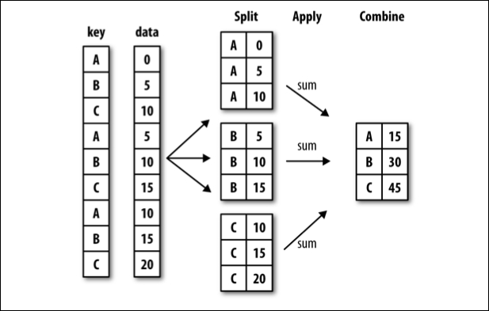

## Dependencies
- Latest version of `R`
  (*free* from <https://www.r-project.org/>)
- Latest version of `Rstudio`
  (also *free* from <https://www.rstudio.com/>)
- A bunch of *free* packages

```{r, eval=FALSE}
# The single tidyverse package now includes
# dplyr and tidyr
install.packages('tidyverse')
# install.packages('dplyr')
# install.packages('tidyr')
```
```{r, echo=FALSE, results='hide', message=FALSE}
options(width=50)
library('tidyverse')
```

## Data Frames: Introduction
- Data frames are the primary representation of data in `R`
- You can think of a data frame as a two-dimensional *table* of data
- It helps your sanity to always think of data frames as a table where
```
Each column represents a variable/feature
Each row represents an observation/instance
```

- Conceptually, a data frame is also a collection of vectors, i.e.,
each column is a vector that belongs to the (parent) data frame
- The fastest path to achieving `R`-ninja status is to get familiar with
data frames

## Data Frames: First Impression
- Let's take a look at an existing dataset, `txhousing` (loaded with `ggplot2` 
--- which is loaded with `tidyverse`)
- Contains data (9 variables) on 8,602 observations about the housing market in 
Texas, from 2000 to 2015
- See documentation for details on what the 9 variables are
```{r, eval=FALSE}
?txhousing
```

## Data Frames: First Impression (cont'd)
```{r}
str(txhousing)  # take a peek at the data frame
```

## Some Question
- What questions could you ask (and answer) with this data?
    - which cities had the highest/lowest volume in sales?
    - what was the annual/monthly sales per city?
    - are there monthly trends across multiple years in listings?
    - what else?

- By the end of this session, we'll have the tools to answer most (if not all)
of the questions you can come up with!

# Data Frame Basics

## `tibble`
- A `tibble` is a trimmed down version of `data.frame` that is more convenient
to work with
- Throughout this course, we will use the terms `tibble` and data frames
interchangably, which is technically incorrect, but easier to read

## Simple Example
- Use `tibble()` function (from `tidyverse`) to create a `tibble` data frame
- Arguments of `tibble()` are vectors or lists (of equal length) that constitute
each  column (variable)
- For example, let's create a data frame of the following table:

Age | Personality | Income
--- | ----------- | ------
24  | Good        | 2000
22  | Bad         | 5800
23  | Good        | 4200
25  | Bad         | 1500
22  | Good        | 6000

## Simple Example (cont'd)
- We'll save the data frame to an object (I'll call mine `data`)
```{r}
data <- tibble(  # start tibble()
  age = c(24, 22, 23, 25, 22),
  personality = c('g', 'b', 'g', 'b', 'g'),
  income = c(2000, 5800, 4200, 1500, 6000)
)  # finish the tibble() function
```
- Note that the new lines are just a matter of coding style, i.e., it makes the
code easier to read
- The same data frame can be created in a single line:
```{r, eval=FALSE}
data <- tibble(age = c(24, 22, 23, 25, 22),
personality = c('g', 'b', 'g', 'b', 'g'), income
= c(2000, 5800, 4200, 1500, 6000))
```

## Simple Example (cont'd)
- Let's take a look at our new data frame
```{r}
data
```

## Indexing: The `$` Operator
- The `$` operator lets you reference elements of an object (e.g., column
vectors of a data frame) in `R`
```{r}
data$age
data$personality
```

## Indexing: The `[` Operator
- The `[` operator, similar to the `$` operator, lets you reference elements of
an object (e.g., column vectors of a data frame) either by name *or by index*
```{r}
data['age']
```

## Indexing: The `[` Operator (cont'd)
```{r}
data[1]
```

## Indexing: The `[[` Operator (cont'd)
- Note that when using the `[` operator, unlike `$`, you get a new data frame of
the indexed column, *not* a vector.
- Use the `[[` operator if you want a vector instead
```{r}
data[[1]]
```

## Indexing: Numeric Row/Column
- Since a data frame is a table of data, you can treat it like a matrix, and
index its entries by `[row #, col #]` notation
```{r}
data[2, 3]  # item in row 2 column 3
data[, 2]  # entire column 2
data[4, ]  # entire row 4
```

## Indexing: Named Variables
- Since the columns represent variables with names, you can index columns by a
string representing variable names
```{r}
data[, 'age']  # entire 'age' column
# entries 3~5 of 'personality' column
data[3:5, 'personality']
```

## Indexing: Vectors
- As with vectors/matrices, you can index a data frame with vectors
(either numeric or string)
```{r}
data[1:3, c('age', 'income')]
data[c(1, 4), 2:3]
```

## Conditional Indexing
- Pick out entries that match specific criteria by first creating a binary
vector for indexing
```{r}
# find the 22-year-olds
ind <- data$age == 22
data[ind, ]  # index rows by binary vector ind
```

## Chained Indexing
- Note that
    - when you index rows of a single column, the result is a vector
    - when you index multiple columns, the result is a new data frame
- You can chain indices to pin-point elements of a data frame
- For example, all of the following operations are (almost) equivalent -- can you tell how the first two are different from the last two?
```{r, eval=FALSE}
# (Almost) Equivalent operations to get the age of
# third observation (row 3)
data[3, 1]  # if you know that 'age' is column 1
data[3, 'age']
data[3, ]$age  # get 'age' of row 3
data$age[3]  # get third observation of 'age' variable
```

## Column (Variable) Names
- To see the column name of a data frame, use the `colnames()` function
- The column names can be changed by directly assigning a new vector of names
to the `colnames()` function
```{r}
colnames(data)
colnames(data) <- c('age', 'attitude', 'income')
data
```

## Write Data Frames to Files
- Use `write_tsv()` to write data frames to tab-separated (text) files
- The syntax is
```
write_tsv(x, path = "")
```
- For example, to save our sample data to a file named `data.tsv` with the
entries of each row separated by a tab character, write
```{r, eval=FALSE}
write_tsv(data, path = 'data.tsv')
```
- Recall, the default directory is the current working directory, specified with
`setwd()`, and retrieved with `getwd()`
- For more options, see documentation
```{r, eval=FALSE}
?write_tsv
```

## Read Data Frames from Files
- To read data frames that exist as text files, use the general `read_table()`
function
- Note that specific options for `read_table()` will depend on the structure of
the text file you wish to read (e.g., comma-separated or tab-separated)
- Some shortcuts for pre-defined for (commonly used) formats
```{r, eval=FALSE}
read_csv(file)           # comma-separated values
read_tsv(file)           # tab-separated values
read_delim(file, delim)  # custom delimiters
```

## Read Data Frames from Files (cont'd)
- For example, to read the `tsv` file we just saved,
```{r}
data <- read_tsv('data.tsv', col_names = TRUE)
```
- Notice how `read_tsv()` guesses the type of your columns
- It's good practice to specify column types manually so that
    1. you know exactly what you want, and
    1. you get what you want

## Specify types for columns
- You can use the output message from the previous `read_tsv()` call as a boiler
plate input to the `col_types` parameter, e.g.,
```{r}
data <- read_tsv('data.tsv', col_types = cols(
  age = col_double(),
  personality = col_character(),
  income = col_double()
), col_names = TRUE)
```

- Or, you can use a compact specification,
```{r}
data <- read_tsv('data.tsv', col_types = 'dcd',
                 col_names = TRUE)
```

- See the documentation for more details
```{r, eval=FALSE}
?read_delim
```

## Read Data from Online Database
- `read_*()` can also load data frames from an online database
- While loading data directly from the web is not recommended, this can be
useful when making a local copy of an online database
- For example, to make a local copy of the dataset saved in
`https://goo.gl/MGzatX`
```{r, eval=FALSE}
address <- 'https://goo.gl/MGzatX'
data <- read_tsv(address)
write_tsv(data, path='data.tsv')
```
- Note that you can read data in one format (e.g., comma-separated) and save
the local copy in another (e.g., tab-separated)

# Exploring Data Frames

## Display Structure with `str()`
- Let's start look at the `txhousing` data frame
- The `str()` function is useful for exploring the overall structure of a
data frame
```{r, eval=FALSE}
str(txhousing)
```
```{r, echo=FALSE}
str(txhousing, strict.width='cut')
```

## `Factor`s
- Note that the city column should be a `factor` -- a data frame representation
of categorical variables

- Use `factor()` to force varaible into factor variables
```{r}
txhousing$city <- factor(txhousing$city)
```
- The entries of a `factor` variable is defined by `levels`
```{r, eval=FALSE}
levels(txhousing$city)
```

## `unique` values
- Use `unique()` to list the unique values of any variable
```{r}
unique(txhousing$year)
```

## Data Frame Basics: Exercise
- From the `txhousing` data
    - create a new data frame for the city "Paris" (i.e., `city == "Paris"`)
    - generate a `summary()` of the inventory in Paris
- These are just (very) basic operations
- For more complicated operations, we'll use `dlyr` and `tidyr` (both part of
`tidyverse` and covered next)

# Exercise Solution

## WARNING
- Solutions to the exercise are presented in the next slide
- Try the exercise before proceeding!

## Solution
```{r, fig.align='center', fig.width=2.5, fig.height=2.5}
ind_paris <- txhousing$city == "Paris"
paris <- txhousing[ind_paris, ]
summary(paris$inventory)
```


# Wrangling Data with `dplyr`

## Introduction to `dplyr`
- `dplyr` is a package that provides a convenient framework (along with a
handful of useful functions) for wrangling data (frames)
- `dplyr` is a part of the `tidyverse`, so if you load `tidyverse`, `dplyr` is
also loaded
- You can also, but don"t have to, install and load the `dplyr` as a standalone
package like you  would any other `R` package
```{r, eval=FALSE}
# Only need to do this once on a single machine.
install.packages("dplyr")
# load package into workspace
library("dplyr")
```

## Data Frames: First Impression
- We'll primarily use the `diamonds` data that's included with `tidyverse`
- Take a look by typing `diamonds` in the `R` console
- `diamonds` is a dataset containing the prices and other attributes of almost 
54,000 diamonds. Included variables are:
    - price, carat, cut, color, clarity, dimensions (x, y, z, depth, table)
    
- See documentation for more details 
```{r, eval=FALSE}
?diamonds
```

## Verbs
- A *verb* in the world of `dplyr` is a function that 
    - takes a data frame as its first argument, and 
    - returns another data frame as a result
- For example, the `head()` function can be considered a verb
```{r, eval=FALSE}
head(diamonds, n = 3)
```
- Note that the result of the `head()` function is another data frame
(in this case, with 3 rows)
- The **core idea of `dplyr`** is that most of your data manipulation needs can
be satisfied with 5 basic verbs (or 4, depending on how you categorize them)

## Five basic verbs
- The five basic verbs of `dplyr` and associated actions are presented below

verb          | action
----          | ------
`filter()`    | select a subset of *rows* by specified conditions
`select()`    | select a subset of *columns*
`mutate()`    | create a *new column* (often from existing columns)
`arrange()`   | reorder (sort) *rows* by values of specified *column*(s)
`summarize()` | aggregate values and reduce to single value

- Some verbs have additional options or convenient wrappers

# Selecting rows (1/5)
## Selecting Rows: `filter()`
- Select a subset of *rows*
- Multiple conditions can be used
- Use `&` to specify `AND` conditions
- Use `|` to specify `OR` conditions
- `AND(&)`/`OR(|)` operations can be used together
(where default behavior for multiple conditions is `AND`)
```{r, eval=FALSE}
filter(diamonds, cut == "Ideal" & carat > 3)
filter(diamonds, carat <= .2 |  carat >= 3)
filter(diamonds,
       carat <= .2 |  carat >= 3, color == "D")
```
- Use `%in%` to match on a collection of values
```{r, eval=FALSE}
filter(diamonds, cut %in% c("Fair", "Ideal"))
```


## Selecting Rows: `slice()`
- To select rows by numerical index (position), use `slice()`
- For example, to select the first 10 rows
```{r, eval=FALSE}
slice(diamonds, 1:10)
```
- or to select the last 10 rows
```{r, eval=FALSE}
slice(diamonds, (n() - 9):n())
```
- Use `n()` inside a `dplyr` verb to to indicate the *number of rows* of the
data frame

# Selecting columns (2/5)
## Selecting Columns: `select()`
- Select a subset of *columns*
- Either specify the columns that you want to select
```{r, eval=FALSE}
select(diamonds, cut, price)
```
- Or specify the columns you wish to drop
```{r, eval=FALSE}
select(diamonds, -x, -y, -z)
```

## Selecting Columns: `select()` (cont'd)
- `dplyr` provides useful helper functions you can use to `select()` columns
that match specific criteria such as
    - `starts_with(x)`: names that start with `x`
    - `ends_with(x)`: names that end with `x`
    - `contains(x)`: names that contain `x`
    - `matches(x)`: names that match the (regular expression) `x`
- See the documentation for more details
```{r, eval=FALSE}
?dplyr::select
```
- While you can assign new column names with `select()` the convenience function
`rename()` lets you rename columns while retaining the rest of the data frame
```{r, eval=FALSE}
rename(diamonds, cut_type = cut)
```

# Creating new columns (3/5)
## Create New Columns: `mutate()`
- Create new columns, usually as a function of existing columns
- You can refer to new columns you just created, inside the same `mutate()`
function
```{r, eval=FALSE}
mutate(diamonds, 
       price_per_carat = price / carat,
       volume = x * y * z,
       # Use the volume column we just created
       # to create yet another price_per_volume column
       price_per_volume = price / volume
       )
```
- Use `transmute()` to create a new data frame *just from* the new column(s)
```{r, eval=FALSE}
transmute(diamonds, carat, 
          price_per_carat = price / carat)
```

# Sorting (4/5)
## Sorting Rows by Column Value: `arrange()`
- Reorder the rows of a data frame by the specified column"s value
- Multiple conditions are arranged from left to right
- Use `desc()` to arrange in descending order
```{r, eval=FALSE}
arrange(diamonds, carat, price)
arrange(diamonds, carat, desc(price))
arrange(diamonds, desc(carat), desc(price))
```

# Aggregating (5/5)
## Aggregate Data: `summarize()`
- Aggregate/collapse the data into a single row
- Think of as applying a function to columns
```{r}
summarize(diamonds, avg_price = mean(price))
```

## Recap:
- The five basic verbs: 

verb          | action
----          | ------
`filter()`    | select a subset of *rows* by specified conditions
`select()`    | select a subset of *columns*
`mutate()`    | create a *new column* (often from existing columns)
`arrange()`   | reorder (sort) *rows* by values of specified *column*(s)
`summarize()` | aggregate values and reduce to single value

- But what about ...
    - Average price of diamonds for each cut type?
    - Largest (carat) diamond in each color category?
    - ...

## Bad example:
- A natural, but tedious way to compute:
- Average price of diamonds for each cut type?
    - use `filter` to create five different data frames, one for each `cut` type
    - use `summarize` to compute the mean price for each data frame
- Largest (carat) diamond in each color category?
    - use `filter` to create seven different data frames, one for each 
    `color` category
    - use `arrange` to sort in descending order of `carat` for each data frame
    - use `slice` to get the first row from each of the `arrange`d data frames
    
- The pattern:
    - split the data, `group`ing `by` some categorical value
    - do some operations, but to each category of the `group`

## Split-Apply-Combine



## Grouped Operations
- If a data frame is *grouped*, operations are applied to each group separately,
and the results are combined back to a single data frame
- The `group_by()` verb lets you specify the *grouping* variables (e.g., `cut`, 
`color`)
```{r, results="hide"}
diamonds_by_cut <- group_by(diamonds, cut)
```
- When the data frame is `group_by`'d, all verbs/functions will operate as if 
each category of the grouping variable is its own data frame, e.g., 

verb          | group specific action
------------- | ------------------------------------------------------
`arrange()`   | sort rows within each group
`slice()`     | extract rows within each group
`summarize()` | aggregate values group-wise
`n()`         | count the number of rows in each group

## Grouped `slice()`
- Retrieve one diamond from each cut
```{r}
slice(diamonds_by_cut, 1)
```

## Grouped `summarize()`
- Retrieve (1) number of diamonds and (2) average price by cut type
```{r}
summarize(diamonds_by_cut,
          count = n(),
          avg_price = mean(price))
```

# Multiple (Chained) Operations

## Multiple (Chained) Operations
- Wish to compute: Proportion of different `color`s in each `cut` category

- We can achieve the desired result with a few operations
    1. **`group_by`** `cut`
    2. **`mutate`** to create a column with total diamonds for each `cut`
    3. re-**`group_by`** `cut` and `color`
    4. Use the new column from above to `summarize` the proportion of each
    `color` within each `cut`

- Note that `dplyr` verbs do **not** modify the original data frame (i.e., they
don't have side effects)
    - This is generally a good thing, since it guarantees the integrity of your data
    - But it makes multiple operations on a data frame difficult

## Multiple Operations: The OK Way
- One way to perform multiple operations is to save intermediate data frames as
new data frames
- This method delivers desired results, but makes your workspace quite messy
(i.e., you"ll end up with a workspace full of intermediate results)
```{r, eval=FALSE}
by_cut <- group_by(diamonds, cut)
count_cuts <- mutate(by_cut, N = n())
by_cut_and_color <- group_by(count_cuts, cut, color)
proportions <- summarize(by_cut_and_color,
                         prop = mean(n()/N))
```
- This method might be prefered if you need the intermediate results in
the future
- If not, there is a better way to chain multiple operations with `dplyr`

## The Pipe Operator `%>%`
- The pipe operator, takes the output from its left-hand side, and uses it as
the first argument to whatever is on its right-hand side[^pipe]
- For example:
```{r, eval=FALSE}
by_cut <- group_by(diamonds, cut)
count_cuts <- mutate(by_cut, N = n())
```
is equivalent to 
```{r, eval=FALSE}
count_cuts <- diamonds %>% 
  group_by(cut) %>%  
  mutate(N = n())
```
(except in the second case, the `by_cut` data frame is never created)

[^pipe]: `Ctrl + Shift + M` will insert `%>%` in Rstudio

## The Pipe Operator `%>%`
- Using the pipe, we can complete the entire task without saving any
intermediate data frames
```{r, eval=FALSE}
proportions <- diamonds %>% 
  group_by(cut) %>% 
  mutate(N = n()) %>% 
  group_by(cut, color) %>% 
  summarize(prop = mean(n()/N))
```
- No need to save intermediate results
- Easier to read (i.e., you can follow the operations step-by-step without too
much mental accounting)

## `dplyr`: Exercise
- Find the most expensive diamond for each `cut`.
- How many 1 carat diamonds are "Premium" `cut`, and what are the min/median/max
prices?
- What is the average price for diamonds grouped by 0.1 `carat`s?

# Exercise Solution

## WARNING
- Solutions to the exercise are presented in the next slide
- Try the exercise before proceeding!

## Solutions
- Find the most expensive diamond for each `cut`.
```{r}
diamonds %>% 
  group_by(cut) %>% 
  arrange(desc(price)) %>% 
  slice(1)
```

## Solutions
- How many 1 carat diamonds are "Premium" `cut?
```{r}
diamonds %>% 
  filter(carat == 1, cut == "Premium") %>% 
  summarize(N = n(),
            min = min(price),
            med = median(price),
            max = max(price))
```

## Solutions
- What is the average price for diamonds grouped by 0.1 `carat`s?
```{r}
diamonds %>% 
  mutate(carat_bin = round(carat, digits = 1)) %>% 
  group_by(carat_bin) %>% 
  summarize(avg_price = mean(price)) 
```

## Reference
- A great "cheat sheet" for wrangling data with `dplyr` and `tidyr` is available
for free at
https://www.rstudio.com/wp-content/uploads/2015/02/data-wrangling-cheatsheet.pdf

- Introductory text book by the creator of `tidyverse`:
http://r4ds.had.co.nz/

# Reshape Data with `tidyr`

## Introduction to `tidyr`
- Recall, the prefered way to think about a data frame:
```
Each column represents a variable/feature
Each row represents an observation/instance
```
- Consider the following (fictional) data frame of students' homework grades

ID | HW1 | HW2 | HW3
--- | --- | --- | ---
jamie | 6 | 7 | 3
cersei | 8 | 5 | 2
hodor | 9 | 10 | 9

- What are the variables of this data?
- What are the potential issues with this representation?
- What are the benefits of this representation?

## Introduction to `tidyr`: An Example
- For data manipulation/visualization we often prefer to have data in the
*long* form
- The *long* form of the previous data would be

ID | HW | Score
--- | --- | ---
jamie | 1 | 6
jamie | 2 | 7
$\vdots$ | $\vdots$ | $\vdots$
hodor | 2 | 10
hodor | 3 | 9

- `tidyr` is a package that provides a tools for converting data between *long*
and *wide* forms

## Introduction to `tidyr`: Getting Started
- `tidyr` is also part of the `tidyverse`, so if you load `tidyverse`, `tidyr`
is also loaded
- You can also, but don't have to, install and load `tidyr` as a standalone
package like you  would any other `R` package
```{r, eval=FALSE}
# Only need to do this once on a single machine.
install.packages('tidyr')
# load package into workspace
library('tidyr')
```

## Introduction to `tidyr`: Getting Started (cont'd)
- Create some random data
```{r}
grades <- tibble(
  ID = c('jamie', 'cersei', 'hodor'),
  HW1 = runif(3, 1, 10),
  HW2 = runif(3, 1, 10),
  HW3 = runif(3, 1, 10),
  info = c('male/lannister', 
           'female/lannister', 
           'male/stark'))
grades
```

## Create *long* data with `gather()`
- With the `grades` data, we would like to create a data frame in the form of

ID | info | HW | score
--- | --- | --- | ---
- | - | - | -

- The verb for gathering multiple columns into key-value pairs in `tidyr`
is `gather()`
- The syntax is
```{r, eval=FALSE}
gather(data, key, value, ...)
```
- where the `...` should be replaced by column specifications

## Create *long* data with `gather()` (cont'd)
```{r, results='hide'}
grades_tidy <- gather(grades, HW, score, HW1:HW3)
grades_tidy
```
```{r, echo=FALSE}
head(grades_tidy)
```

## Split a Column to Multiple Variables with `separate()`
- Often, there will be column that you'd prefer to split into multiple
variables, e.g., splitting a `date` column to `year`, `month`, and `day`
- From the `grades` data, notice that the `info` column combines two variables:
`sex` and `house`
- We can split such columns to multiple variables with the `separate()` verb in `tidyr`

## Split a Column to with `separate()` (cont'd)
```{r, results='hide'}
grades_split <- separate(
  grades_tidy, info, 
  into = c('sex', 'house'), 
  sep = '/'
  )
grades_split
```
```{r, echo=FALSE}
head(grades_split, 3)
```

## Chaining `tidyr` verbs
- Note that `tidyr` operations are also verbs that can be chained with the pipe
operator `%>%`
- For example, we can do the previous operations on the `grades` data with the
chained operation
```{r}
grades_final <- grades %>% 
  gather(HW, score, HW1:HW3) %>% 
  separate(info, into=c('sex', 'house'), sep='/')
```
- `tidyr` verbs can also be chained with `dplyr` verbs (and any other function
that qualifies as a verb, i.e., takes a data frame as the first argument and
results in a new data frame)

## Exercise
- Create some random data
```{r, message=FALSE, warning=FALSE}
address <- 'https://goo.gl/0hFk2w'
finance <- read_tsv(address)
```
1. Tidy the data to fit the form

ID | type | year | amount
--- | --- | --- | --- |
- | - | - | -

2. Find the mean and total Income/Expense for each ID across all years

# Exercise Solution

## WARNING
- Solutions to the exercise are presented in the next slide
- Try the exercise before proceeding!

## Solution 1
```{r, results='hide'}
finance <- finance %>% 
  gather(year, amount, 2:7) %>% 
  separate(year, c('type', 'year'), sep='_')
finance
```
```{r, echo=FALSE}
head(finance, 8)
```

## Solution 2
```{r}
finance_summary <- finance %>% 
  group_by(ID, type) %>% 
  summarize(mean=mean(amount), total=sum(amount))
finance_summary
```

# Combining Data with `join`s

## Basic concatenations
- `rbind`: concatenate rows
- `cbind`: concatenate columns

- For data frames, `bind_rows()` and `bind_cols()` from `dplyr` is usually much
faster.


## Example (with matrix, but works with data frames too)
```{r}
A <- matrix(1:4, 2, 2)
B <- matrix(5:8, 2, 2)
rbind(A, B)
cbind(A, B)
```

## Introduction to `join`s
- Sometimes, you will find relevant data across multiple datasets, e.g., a list
of grades in one dataset and a list of contact information in another
- In such cases, you may want to `join` the two datasets into a single data frame
prior to further analysis
- For a successful `join` you must determine
    1. One or more variables that uniquely identify matching observations (rows)
    in both datasets
    2. How you wish to join the data, i.e.,
        - **Left/right join** Retain one of the datasets entirely, while only
        keeping matching entries of the other, possibly resulting in a few
        missing values (`NA`)
        - **Inner join** Retain only complete matches, possibly dropping some rows
        of both datasets
        - **Outer (full) join** Retain all rows of both datasets, but potentially
        resulting in many missing values (`NA`)

## Example Datasets
- For illustration, let's create two data frames
```{r}
info <- tibble(
  name=c('tony', 'tony', 'rey'),
  job=c('scientist', 'tiger', 'scavenger'),
  score=rnorm(3)
)

power <- tibble(
  name=c('tony', 'hank', 'rey'),
  job=c('scientist', 'scientist', 'scavenger'),
  strength=rexp(3)
)
```
- How is an observation (row) uniquely identified?

## Left/Right `join`
- Retain rows of one dataset, and match the rows of the other
```{r, warning=FALSE}
left_join(info, power, by=c('name', 'job'))
right_join(info, power, by=c('name', 'job'))
```

## Inner `join`
- Retain only the rows that have matches on both datasets
```{r, warning=FALSE}
inner_join(info, power, by=c('name', 'job'))
```

## Outer (Full) `join`
- Retain all rows
```{r, warning=FALSE}
full_join(info, power, by=c('name', 'job'))
```

## Tip: Replace `NA` entries

- To replace *all* `NA` entries in a data frame --- assuming you  know exactly
what you want to change them to! --- index by `is.na` and  re-assign, e.g.,
```{r, warning=FALSE}
everyone <- full_join(info, power, by=c('name', 'job'))

# Replace the NAs with 0 (BAD IDEA!)
everyone[is.na(everyone)] <- 0
everyone
```

## Reference
- A great "cheat sheet" for wrangling data with `dplyr` and `tidyr` is available
for free at
https://www.rstudio.com/wp-content/uploads/2015/02/data-wrangling-cheatsheet.pdf
